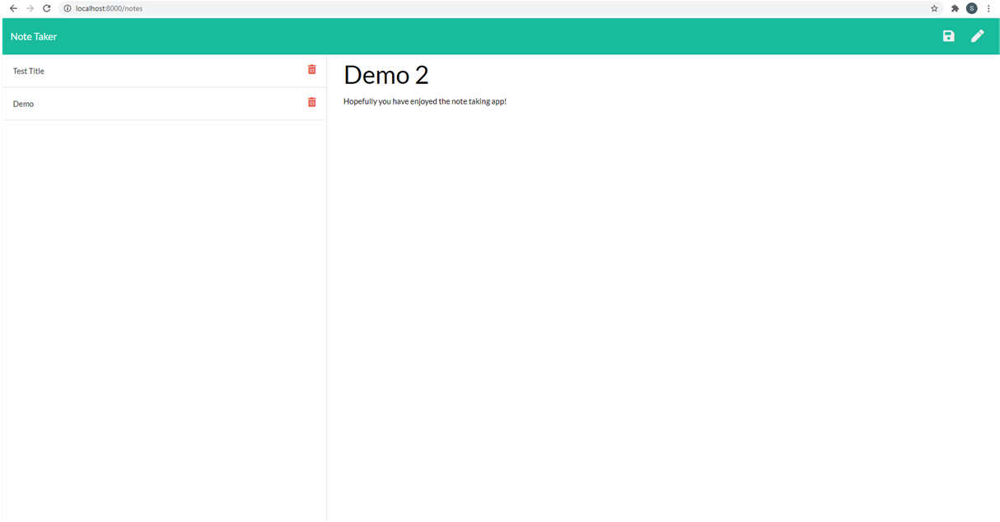

# NoteTaker

## Description

The following app is meant to allow the user to take notes and save them.

To begin, open server.js in the terminal and you should see the app is listening on Port 8000. 

Open this port in your browser at the following URL http://localhost:8000/

From there you should see the cover page. Go ahead and click 'Get Started'.

This will take you to a page where you can click the pencil in the top right of the screen. From there go ahead and click 'Note Title' and add your own.
You can do the same below where it says "Note Text".
Once you have finished adding your notes go ahead and click the floppy disk in the top right of the screen to save your notes. These notes will then appear on the left of the screen.

Enjoy!

